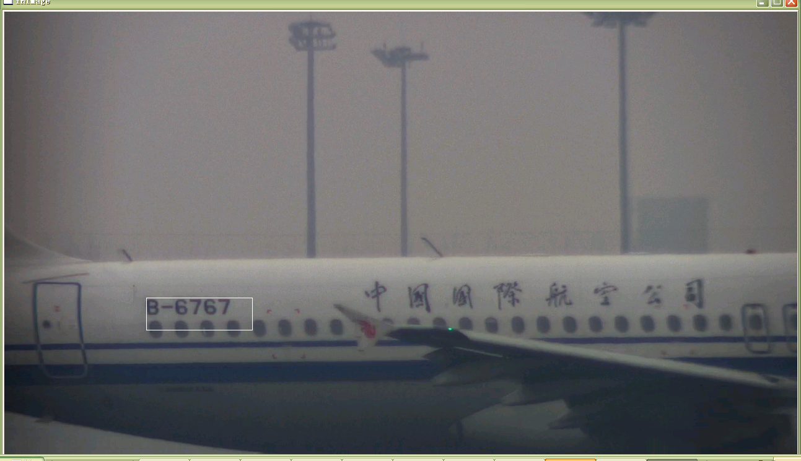
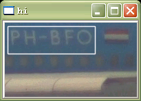
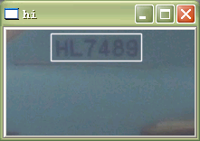
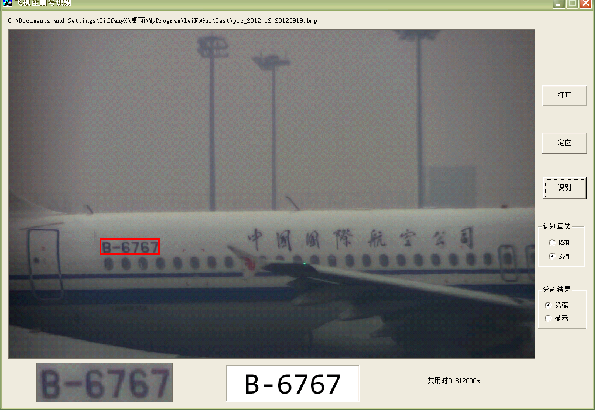
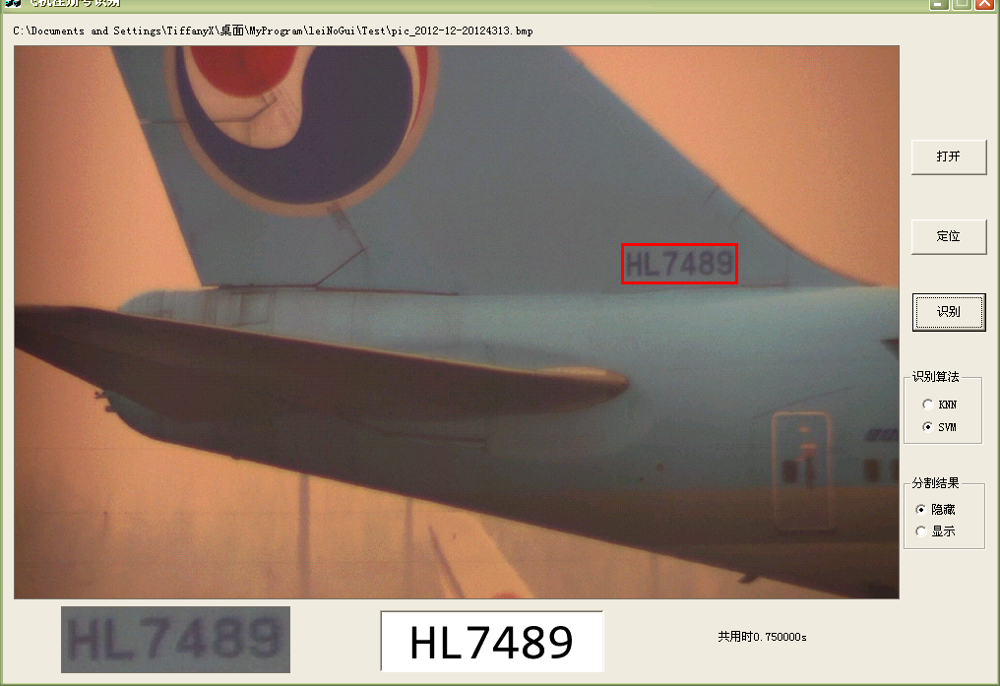

# Aircraft-Registration-Number-Recognition
Using SVM to locate and recognize registration number on aircraft

- SVM
- OpenCV, or you can use the dll I provided
- It was written on Visual C++ 6.0. New version VS may need to change some API

Screenshots:

---
PS: This project was written by me for my ex-girlfriend which was an assignment to my ex who didn't know how to program.....Feel free to use~
